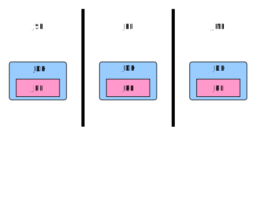
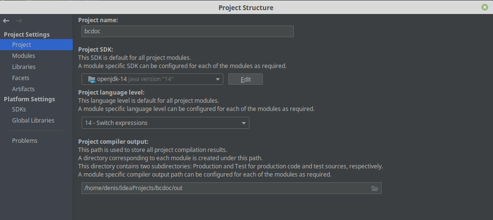
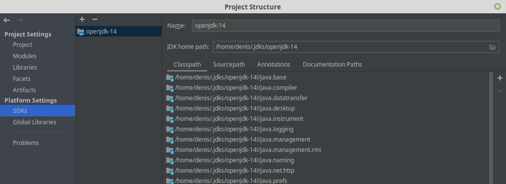
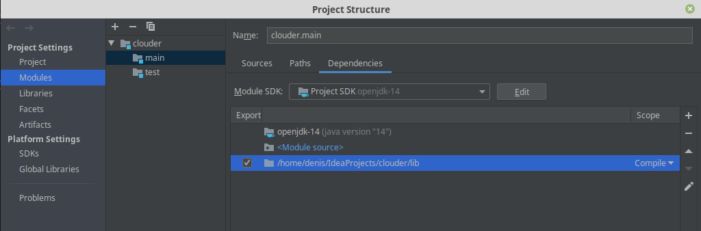
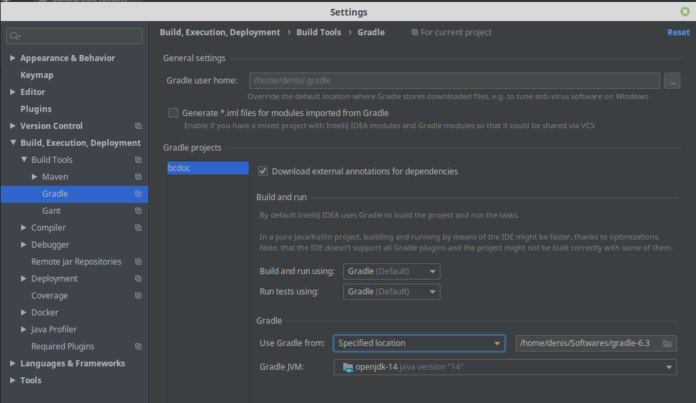

# java-introduction

This repository contains notes about the use of Java.

# Examples

* [part1: the very basic scenario](part1/README.md)
* [part2: produce a JAR and execute the application from the JAR](part2/README.md)
* [part3: use ant to build the application](part3/README.md)
* [part4: use Gradle](part4/README.md)

# JDK, JRE, JSE, JEE, JME... what do all these things mean ?

What do I need to install in order to develop and run a Java application ?

* JDK: Java Development Kit
* JRE: Java Runtime Environment
* JSE: Java Standard Edition (see [this link](https://docs.oracle.com/javaee/6/firstcup/doc/gkhoy.html))
* JEE: Java Enterprise Edition (see [this link](https://docs.oracle.com/javaee/6/firstcup/doc/gkhoy.html))
* JME: Java Micro Edition (see [this link](https://docs.oracle.com/javaee/6/firstcup/doc/gkhoy.html))

Note:

* JSE, JEE and JME define sets of capabilities and functionalities (more details on this [link](https://docs.oracle.com/javaee/6/firstcup/doc/gkhoy.html)).
* The JDK includes the JRE (see [What is the difference between the JRE and the JDK ?](https://java.com/en/download/faq/techinfo.xml)). 
  Thus developers only need to install the JDK.
* JSE, JEE and JME include the JDK (and, thus the JRE).

Thus:

* in order to develop (and eventually run) a Java application, you need to download
  and install one of these:
  [JSE](https://www.oracle.com/technetwork/java/javase/overview/index.html),
  [JEE](https://www.oracle.com/java/technologies/java-ee-glance.html) or
  [LME](https://www.oracle.com/java/technologies/javameoverview.html),
  depending on the capabilities and functionalities you need for your application.
* if you only need to execute Java applications, you need to download and install the [JRE](https://java.com/en/).

## And what about the version ?

Suppose that you download and install Java Platform, Standard Edition 14 (JSE 14) [here](https://www.oracle.com/technetwork/java/javase/overview/index.html).

[jse 14 download image](doc/jse14-download.PNG)

You just downloaded the file `jdk-14_windows-x64_bin.zip`.

> Make sure that your path points to the right location. You can get the path to the
> Java VM that is executed by issuing this command: `java -XshowSettings:properties -version`

OK, then, what do you have ?

Get the JDK version:

	$ java -version
	java version "14" 2020-03-17
	Java(TM) SE Runtime Environment (build 14+36-1461)
	Java HotSpot(TM) 64-Bit Server VM (build 14+36-1461, mixed mode, sharing)

You have the JDK version `14`. That seems normal.

But wait! I also installed:

* Java Platform, Standard Edition 8 (JSE 8) [here](https://www.oracle.com/technetwork/java/javase/overview/index.html)
* Java Platform, Standard Edition 11 (JSE 11) [here](https://www.oracle.com/technetwork/java/javase/overview/index.html)

[jse 11 download image](doc/jse11-download.PNG)

For the servtion 8, I get this output:

	$ java -version
	openjdk version "1.8.0_212"
	OpenJDK Runtime Environment (AdoptOpenJDK)(build 1.8.0_212-b03)
	OpenJDK 64-Bit Server VM (AdoptOpenJDK)(build 25.212-b03, mixed mode)

For the version 11, I get this output:

	$ java -version
	java version "11.0.6" 2020-01-14 LTS
	Java(TM) SE Runtime Environment 18.9 (build 11.0.6+8-LTS)
	Java HotSpot(TM) 64-Bit Server VM 18.9 (build 11.0.6+8-LTS, mixed mode)

In JDK 8 and JRE 8, the version strings are `1.8` and `1.8.0` ([see "Java Platform, Standard Edition 8 Names and Versions"](https://www.oracle.com/technetwork/java/javase/jdk8-naming-2157130.html)).
However, for JDK 11 and 14, the version string are, respectively, `11....` and `14....`.

What ??? What's going on here ???

Don't bother too much. The Java versioning system is not consistent.
See [Java version history](https://en.wikipedia.org/wiki/Java_version_history).

# IntelJ configuration

Set the path to the SDK (Java or Groovy):

	`File` -> `Project Structure` -> `Project Settings` -> `Project` -> `Project JDK`
	                              -> `Platform Settings` -> `SDKs`

Add JARs that must be known by IntelJ:

	`File` -> `Project Structure` -> `Modules`
	                              -> `<project name>` -> `main`
	                              the add the JARs and add "Export"

Eventually, especially if you use multi-project Gradle configuration, then declare the paths to the source files:

# Gradle

## IntelJ configuration

You may need to specify the path to your local installation of Gradle.

**You should use Gradle version 6.3 or greater**.

To do that:

	`File` -> `Settings` -> `Build, Execution, Deployment` -> `Gradle`

Then, in the section "Gradle Projects":

	Use Gradle from: Specified location

And select the path to your local Gradle installation.

## Prerequisites

Before you dive into Gradle, you should learn a little bit of Groovy.
In particular, you should look at:

* closure delegates since the "Gradle script syntax" relies heavily on this concept.
* maps and function calls.

Closure delegates:

	// The function/method "repositories" is called with a closure as unique parameter.
	// This closure has a delegate, wich defines the method "mavenCentral".
	repositories {
	    mavenCentral()
	}

or:

    task hi {
        // The method "doLast" is a method of the closure delegate.
        doLast {
            println "hi!"
        }
    }

Maps and function calls

	// Execute the function/method "apply" on the map (["plugin": java]).
	apply plugin: java

See [this document](doc/groovy.md) and [this document](https://github.com/denis-beurive/gradle-explorer).

